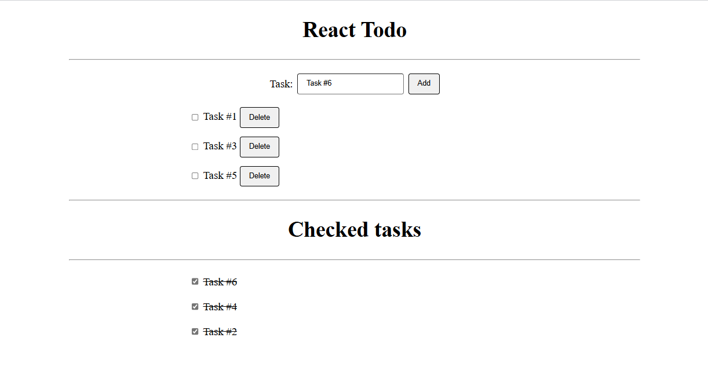

# React Todo App

This is a simple todo app in React that implements the very basic features of what a todo app requires.

The project is functional for those who like minimalistic UI and just needs a list of the tasks they need to get done.

## Screenshot


## Features
- Create a new task.
- Delete a task item.
- Check off a task item.
- Uncheck finished tasks.

## Technologies
- HTML
- CSS
- JavaScript
- ReactJS

## How to run the project
```bash
# Clone the project
git clone https://github.com/hasinajy/react-todo.git

# Switch to the project directory
cd react-todo

# Install all dependencies
npm install

# Run the game
npm start
```
## Contributing
Contribution is always welcome. If you would like to add a new feature, open a PR and we can make this app better by working together.

## LICENSE
The project is licensed under the [MIT License](./LICENSE.md). Refer to the license copy for more information.

## Author
Hasina JY
